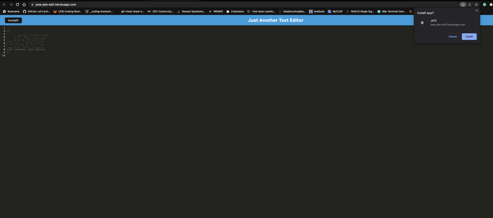

# **PWA Text Editor Web Application**

# Description

This is a text editor web application built using modern web technologies. The application provides a seamless and user-friendly experience for creating and editing text content. Below is a brief description of the key features and functionalities of the application.

## Folder Structure and Setup
Upon opening the application in an editor, you will find a client-server folder structure. This separation allows for efficient development and maintenance of both the client-side and server-side code.

## Starting the Application
To run the application, navigate to the root directory and execute the command `npm run start`. This will start up the backend server and serve the client-side application, making it accessible in your browser.

## Bundling with Webpack
The JavaScript files in the application are bundled using Webpack, a popular module bundler. This enables efficient code organization and optimization, resulting in improved performance and loading speeds.

## Webpack Plugins
By running the webpack plugins, you will generate an HTML file, a service worker, and a manifest file. These files play important roles in enhancing the application's functionality, offline capabilities, and seamless installation as a Progressive Web Application (PWA).

## Next-Generation JavaScript Support
The application fully supports the use of next-generation JavaScript features. You can leverage the latest language advancements while ensuring that the text editor functions smoothly in modern browsers without any errors.

## Persistent Storage with IndexedDB
The text editor utilizes IndexedDB, a powerful browser-based database, for immediate storage of your content. Upon opening the editor, IndexedDB automatically creates a database to store your text data.

## Auto-Save Functionality
As you enter content and interact with the editor, your changes are automatically saved in IndexedDB. Even if you click off the DOM window or close the application, your content remains intact and can be retrieved when you reopen the text editor.

## Install as Desktop App
The application offers an "Install" button, allowing you to download and install the web application as an icon on your desktop. This enables quick access to the text editor without the need to open a browser.

## Service Worker and Workbox Integration
Upon loading the web application, a service worker is registered using Workbox, a powerful library for service worker management. This enables advanced caching strategies for static assets, resulting in faster subsequent page loads and offline access.

## Deployment to Heroku
The application is designed to be easily deployed to Heroku, a popular cloud platform. Proper build scripts are included to ensure a smooth deployment process, enabling you to host your text editor web application effortlessly.

This README provides a high-level overview of the text editor web application and its features. For detailed instructions on setup, configuration, and deployment, please refer to the accompanying documentation. Enjoy a seamless and efficient text editing experience with our web application!

## Table of Contents 

* [Installation](#installation)
* [Usage](#usage)
* [Credits](#credits)
* [License](#license)

## Installation

# Usage 

## Click Link below to navigate to website

[pwa](https://pwa-jate-edit.herokuapp.com/)

## Install

- click okay to allow installation

  

### Login

### Sign Up

## License

## Credits

## Badges

## **Author**

* **Kenneth Cruz** 
- [Link to Repo](https://github.com/Cruzkenneth504/tech-blog)
- [Link to Github](https://github.com/cruzkenneth504)
- [Link to LinkedIn](linkedin.com/in/cruzkenneth504)

## **Acknowledgments**

* [UCB BootCamp](https://bootcamp.berkeley.edu/)
* [DevTools](https://dev.to/)
* [Youtube](https://www.youtube.com/)
* [Bootcamp Instructors](https://bootcamp.berkeley.edu/)
* [Tutors]( https://tinyurl.com/BootCampTutorTeam)
 

